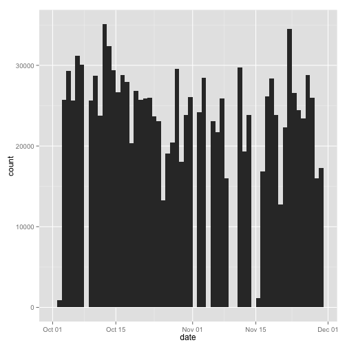
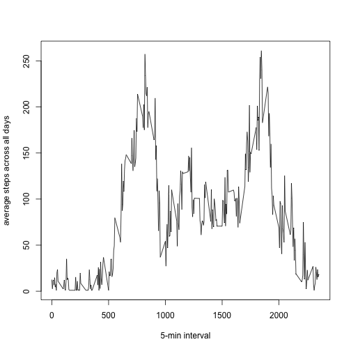
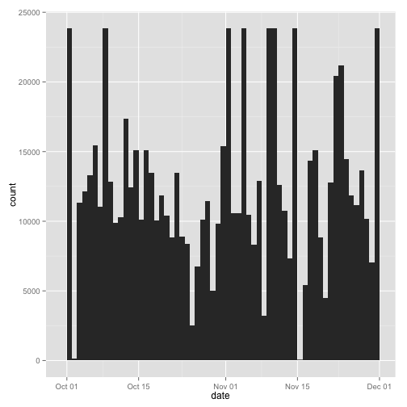
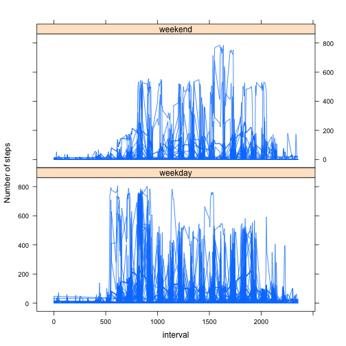

# Reproducible Research: Peer Assessment 1  

The following are the graphic libraries required in R to get the code working properly.


```r
library(ggplot2)
library(lattice)
```

## Loading and preprocessing the data  

The data is provided as a zip file, uncompress the file in your work directory
The following code will load the data contained in the *activity.csv* file into R in a data frame identified as *data*


```r
data <- read.table("activity.csv",
                   sep = ",",
                   header = TRUE,
                   colClasses = c("factor", "Date", "numeric"))
```


## What is mean total number of steps taken per day?  

I will ignore the missing values contained in *data* creating a new data frame identified as *steps* additionally, the steps column will be converted as numeric now that I know that the missing values were removed.


```r
steps <- data[!is.na(data$steps),c("date","steps")]
steps$steps <- as.numeric(steps$steps)
```

This is a histogram of the steps taken per day using the new *steps* data frame

```r
steps.hist <- qplot(as.Date(date), data = steps, weight = steps, geom = "histogram", binwidth = 1, xlab = "date")
print(steps.hist)
```

 

The following code will calculate the median and mean total number of steps per day    
**Mean:**

```r
steps.mean <- aggregate(steps ~ date, steps, mean)
names(steps.mean)[2] <- "mean"
steps.mean
```

```
##          date    mean
## 1  2012-10-02   3.177
## 2  2012-10-03  89.215
## 3  2012-10-04 101.865
## 4  2012-10-05  89.007
## 5  2012-10-06 108.420
## 6  2012-10-07 104.528
## 7  2012-10-09  89.118
## 8  2012-10-10  99.642
## 9  2012-10-11  82.521
## 10 2012-10-12 121.920
## 11 2012-10-13 112.319
## 12 2012-10-14 102.062
## 13 2012-10-15  92.719
## 14 2012-10-16  99.913
## 15 2012-10-17  97.059
## 16 2012-10-18  70.531
## 17 2012-10-19  93.229
## 18 2012-10-20  89.444
## 19 2012-10-21  89.983
## 20 2012-10-22  90.160
## 21 2012-10-23  82.292
## 22 2012-10-24  80.257
## 23 2012-10-25  46.007
## 24 2012-10-26  66.115
## 25 2012-10-27  71.066
## 26 2012-10-28 102.528
## 27 2012-10-29  62.663
## 28 2012-10-30  82.726
## 29 2012-10-31  90.608
## 30 2012-11-02  83.951
## 31 2012-11-03  98.688
## 32 2012-11-05  80.264
## 33 2012-11-06  75.403
## 34 2012-11-07  89.833
## 35 2012-11-08  55.653
## 36 2012-11-11 103.219
## 37 2012-11-12  67.236
## 38 2012-11-13  82.885
## 39 2012-11-15   3.882
## 40 2012-11-16  58.521
## 41 2012-11-17  90.778
## 42 2012-11-18  98.632
## 43 2012-11-19  82.799
## 44 2012-11-20  44.278
## 45 2012-11-21  77.462
## 46 2012-11-22 119.778
## 47 2012-11-23  92.184
## 48 2012-11-24  85.024
## 49 2012-11-25  81.347
## 50 2012-11-26 100.056
## 51 2012-11-27  90.153
## 52 2012-11-28  55.573
## 53 2012-11-29  60.090
```
**Median:**

```r
steps.median <- aggregate(steps ~ date, steps, median) 
names(steps.median)[2] <- "median"
steps.median
```

```
##          date median
## 1  2012-10-02      1
## 2  2012-10-03      1
## 3  2012-10-04      1
## 4  2012-10-05      1
## 5  2012-10-06      1
## 6  2012-10-07      1
## 7  2012-10-09      1
## 8  2012-10-10      1
## 9  2012-10-11      1
## 10 2012-10-12      1
## 11 2012-10-13      1
## 12 2012-10-14      1
## 13 2012-10-15      1
## 14 2012-10-16      1
## 15 2012-10-17      1
## 16 2012-10-18      1
## 17 2012-10-19      1
## 18 2012-10-20      1
## 19 2012-10-21      1
## 20 2012-10-22      1
## 21 2012-10-23      1
## 22 2012-10-24      1
## 23 2012-10-25      1
## 24 2012-10-26      1
## 25 2012-10-27      1
## 26 2012-10-28      1
## 27 2012-10-29      1
## 28 2012-10-30      1
## 29 2012-10-31      1
## 30 2012-11-02      1
## 31 2012-11-03      1
## 32 2012-11-05      1
## 33 2012-11-06      1
## 34 2012-11-07      1
## 35 2012-11-08      1
## 36 2012-11-11      1
## 37 2012-11-12      1
## 38 2012-11-13      1
## 39 2012-11-15      1
## 40 2012-11-16      1
## 41 2012-11-17      1
## 42 2012-11-18      1
## 43 2012-11-19      1
## 44 2012-11-20      1
## 45 2012-11-21      1
## 46 2012-11-22      1
## 47 2012-11-23      1
## 48 2012-11-24      1
## 49 2012-11-25      1
## 50 2012-11-26      1
## 51 2012-11-27      1
## 52 2012-11-28      1
## 53 2012-11-29      1
```


## What is the average daily activity pattern?  

Let's extract data again to the *steps* data frame but this time including the interval values to create a time series plot that uses the 5-minute interval as x-axis and the number of steps taken, averaged across all days as the y-value


```r
steps <- data[!is.na(data$steps),c("steps", "interval")]
steps$steps <- as.numeric(steps$steps)
steps.interval <- aggregate(steps ~ interval, steps, mean)

plot(steps.interval$interval,
     steps.interval$steps,
     type = "l",
     ylab = "average steps across all days",
     xlab = "5-min interval")
```

 

To calculate the 5-minute interval, on average across all the days in the dataset, that contains the maximum number of steps use the following code


```r
steps.interval[which.max(steps.interval$steps), "interval"]
```

```
## [1] 1845
```

## Imputing missing values  

This is how to get the total number of missing values in the original data set *data*


```r
sum(is.na(data$steps))
```

```
## [1] 2304
```

** Strategy to replace missing values **  

For filling all those missing values from the original data set, what I'm going to do is to replace them using the avarage for the respective 5-minute interval, and then get rid of the decimal positions of the new values to keep the integer standard used in the column.  

The new data frame will be identifed as *newData*. It is created by going over all rows of the original data set, replacing the necessary values and appending them to a the data set.


```r
newData <- NULL
for(i in seq_len(nrow(data))){
     if(is.na(data$steps[i])){
          avgSteps <- steps.interval[with(steps.interval, steps.interval$interval == data$interval[i]), "steps"]
          newRow <- data[i,]
          newRow$steps <- round(avgSteps,0)
     }
     else{
          newRow <- data[i,] 
     }
     newData <- rbind(newData, newRow)
}
```

Now I'm going to create the the histagram, median and mean values again to compare the results now with the filled in values.


```r
newSteps <- newData[,c("date","steps")]
newSteps$steps <- as.numeric(newSteps$steps)

newSteps.hist <- qplot(as.Date(date), data = newSteps, weight = steps, geom = "histogram", binwidth = 1, xlab = "date")
print(newSteps.hist)
```

 

Now we'll calculate the mean and median per day again over the data set with the missing values replaced  
**Mean:**

```r
newSteps.mean <- aggregate(steps ~ date, newSteps, mean)
names(newSteps.mean)[2] <- "mean"
newSteps.mean
```

```
##          date    mean
## 1  2012-10-01 82.8264
## 2  2012-10-02  0.4375
## 3  2012-10-03 39.4167
## 4  2012-10-04 42.0694
## 5  2012-10-05 46.1597
## 6  2012-10-06 53.5417
## 7  2012-10-07 38.2465
## 8  2012-10-08 82.8264
## 9  2012-10-09 44.4826
## 10 2012-10-10 34.3750
## 11 2012-10-11 35.7778
## 12 2012-10-12 60.3542
## 13 2012-10-13 43.1458
## 14 2012-10-14 52.4236
## 15 2012-10-15 35.2049
## 16 2012-10-16 52.3750
## 17 2012-10-17 46.7083
## 18 2012-10-18 34.9167
## 19 2012-10-19 41.0729
## 20 2012-10-20 36.0938
## 21 2012-10-21 30.6285
## 22 2012-10-22 46.7361
## 23 2012-10-23 30.9653
## 24 2012-10-24 29.0104
## 25 2012-10-25  8.6528
## 26 2012-10-26 23.5347
## 27 2012-10-27 35.1354
## 28 2012-10-28 39.7847
## 29 2012-10-29 17.4236
## 30 2012-10-30 34.0938
## 31 2012-10-31 53.5208
## 32 2012-11-01 82.8264
## 33 2012-11-02 36.8056
## 34 2012-11-03 36.7049
## 35 2012-11-04 82.8264
## 36 2012-11-05 36.2465
## 37 2012-11-06 28.9375
## 38 2012-11-07 44.7326
## 39 2012-11-08 11.1771
## 40 2012-11-09 82.8264
## 41 2012-11-10 82.8264
## 42 2012-11-11 43.7778
## 43 2012-11-12 37.3785
## 44 2012-11-13 25.4722
## 45 2012-11-14 82.8264
## 46 2012-11-15  0.1424
## 47 2012-11-16 18.8924
## 48 2012-11-17 49.7882
## 49 2012-11-18 52.4653
## 50 2012-11-19 30.6979
## 51 2012-11-20 15.5278
## 52 2012-11-21 44.3993
## 53 2012-11-22 70.9271
## 54 2012-11-23 73.5903
## 55 2012-11-24 50.2708
## 56 2012-11-25 41.0903
## 57 2012-11-26 38.7569
## 58 2012-11-27 47.3819
## 59 2012-11-28 35.3576
## 60 2012-11-29 24.4688
## 61 2012-11-30 82.8264
```
**Median:**

```r
newSteps.median <- aggregate(steps ~ date, newSteps, median) 
names(newSteps.median)[2] <- "median"
newSteps.median
```

```
##          date median
## 1  2012-10-01     76
## 2  2012-10-02      0
## 3  2012-10-03      0
## 4  2012-10-04      0
## 5  2012-10-05      0
## 6  2012-10-06      0
## 7  2012-10-07      0
## 8  2012-10-08     76
## 9  2012-10-09      0
## 10 2012-10-10      0
## 11 2012-10-11      0
## 12 2012-10-12      0
## 13 2012-10-13      0
## 14 2012-10-14      0
## 15 2012-10-15      0
## 16 2012-10-16      0
## 17 2012-10-17      0
## 18 2012-10-18      0
## 19 2012-10-19      0
## 20 2012-10-20      0
## 21 2012-10-21      0
## 22 2012-10-22      0
## 23 2012-10-23      0
## 24 2012-10-24      0
## 25 2012-10-25      0
## 26 2012-10-26      0
## 27 2012-10-27      0
## 28 2012-10-28      0
## 29 2012-10-29      0
## 30 2012-10-30      0
## 31 2012-10-31      0
## 32 2012-11-01     76
## 33 2012-11-02      0
## 34 2012-11-03      0
## 35 2012-11-04     76
## 36 2012-11-05      0
## 37 2012-11-06      0
## 38 2012-11-07      0
## 39 2012-11-08      0
## 40 2012-11-09     76
## 41 2012-11-10     76
## 42 2012-11-11      0
## 43 2012-11-12      0
## 44 2012-11-13      0
## 45 2012-11-14     76
## 46 2012-11-15      0
## 47 2012-11-16      0
## 48 2012-11-17      0
## 49 2012-11-18      0
## 50 2012-11-19      0
## 51 2012-11-20      0
## 52 2012-11-21      0
## 53 2012-11-22      0
## 54 2012-11-23      0
## 55 2012-11-24      0
## 56 2012-11-25      0
## 57 2012-11-26      0
## 58 2012-11-27      0
## 59 2012-11-28      0
## 60 2012-11-29      0
## 61 2012-11-30     76
```

The values differ from the first part of the assignment, imputting missing values from the original values is reflected in different dates, they show more data and higher number of steps for the date in general.

## Are there differences in activity patterns between weekdays and weekends?  

First, lets add new variable *daytype* that indicates if the date is a weekday or a weekend

```r
newData <- transform(newData, daytype = ifelse(weekdays(as.Date(newData$date)) %in% c('Saturday', 'Sunday'), 'weekend', 'weekday'))
newData$steps <- as.numeric(newData$steps)
```

Now, using lattice package I will create a plot panel using the brand new variable

```r
xyplot(steps ~ interval | daytype, data = newData, layout = c(1, 2), type = "l", ylab = "Number of steps")
```

 

For the lower intervals the data looks similar, and in general looks the same, the chunk containing intervals between 500 and 1000 shows the biggest difference for the weekdays, which depending on the study objects might make sense since people is probably walking work when commuting to school, work, etc.
